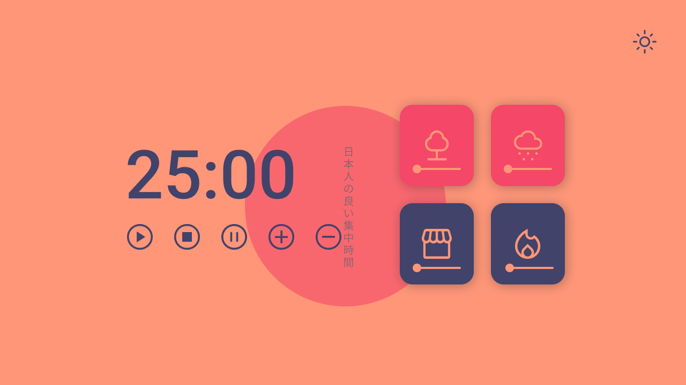

<h1 align="center"> Focus Timer - Versão final </h1>

 

  <a href="#-tecnologias">Tecnologias</a>&nbsp;&nbsp;&nbsp;|&nbsp;&nbsp;&nbsp;
  <a href="#-descrição">Descrição</a>&nbsp;&nbsp;&nbsp;|&nbsp;&nbsp;&nbsp;
  <a href="#confira-o-projeto">Confira o projeto</a>&nbsp;&nbsp;&nbsp;

  

## 🚀 Tecnologias

Esse projeto foi desenvolvido com as seguintes tecnologias:

- HTML
- CSS
- JavaScript
- Figma
- Git e Github

---

 

## 💻 Descrição

Projeto desenvolvido com vase no pomodoro Focus Timer, desenvolvido por mim anteriormente. Seguindo um desafio do programa Explorer, da @rocketseat, desenvolvi um pomodoro melhorado e acabei desenvolvendo outras funcionalidade e melhorias, bem como um design totalmente diferente e de minha própria autoria.

 Para projetá-lo, utilizei conhecimentos que aprendi no programa já citado, conceitos de design que aprendi durante minha jornada e MUITAAAA PESQUISA! 

**As funcionalidades do projeto são:**

- Temporizador com painel para controle do tempo. O painel conta com um botão para iniciar e pausar o timer, um botão de reset, que retorna o temporizador ao tempo inicial e dois botões que adicionam e diminuem 5 minutos do temporizador respectivamente.
- Conta com cards que executam áudios simulando o ambiente desejado, cujo volume é controlado pelos sliders no próprio card. 
- O projeto conta também com um tema Dark, que pode ser acessado clicando no botão no canto superior direito. Do mesmo modo, pode-se clicar no botão novamente para retornar ao mogo Light do projeto.
- Por fim, o projeto é totalmente responsivo, podendo ser utilizado na maioria dos dispositivos.

 

## 🔑 Acesse o projeto!

## [FocusTimer.io](https://eduvieira131.github.io/Focus-timer2.0/)

---

## Confira o projeto:

  Uma pequena amostra sobre o que esperar do projeto!

 

  

